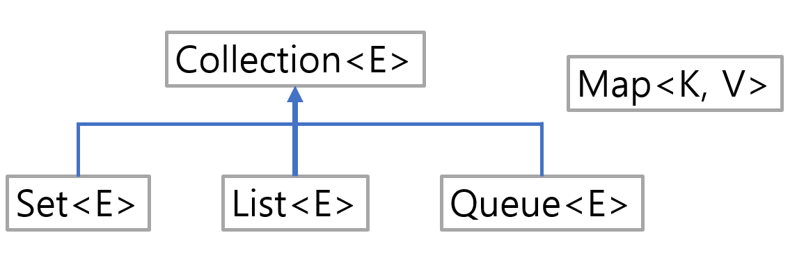

# 컬렉션 프레임워크의 이해
- 인스턴스에 어떻게 저장, 삭제, 참조할 것인가?

## 컬렉션 프레임워크의 인터페이스


<hr>

# List<E> 인터페이스를 구현하는 컬렉션 클래스들
## 대표적인 List<E> 인터페이스를 구현하는 클래스
- ArrayList<E> : 배열 기반 자료구조, 배열을 이용하여 인스턴스 저장 
- LinkedList<E> : 리스트 기반 자료구조, 리스트를 구성하여 인스턴스 저장
## List<E> 인터페이스를 구현하는 클래스의 특성
- 인스턴스의 저장 순서 유지
- 동일 인스턴스의 중복 저장을 허용한다.

## 1. ArrayList<E>
```java
public static void main(String[] args) {
        List<String> list = new ArrayList<>(); // 컬렉션 인스턴스 생성

        // 컬렉션 인스턴스에 문자열 인스턴스 저장
        list.add("Toy");
        list.add("Box");
        list.add("Robot");

        for(int i=0; i<list.size(); i++){
        System.out.print(list.get(i)+'\t');
        }
        System.out.println();

        list.remove(0);
        for(int i=0; i<list.size(); i++){
        System.out.print(list.get(i)+'\t');
        }
        System.out.println();
}
```

## 2. LinkedList<E>
```java
public static void main(String[] args) {
        List<String> list = new LinkedList<>(); // 유일한 변화!

        // 컬렉션 인스턴스에 문자열 인스턴스 저장
        list.add("Toy");
        list.add("Box");
        list.add("Robot");

        for(int i=0; i<list.size(); i++){
        System.out.print(list.get(i)+'\t');
        }
        System.out.println();

        list.remove(0);
        for(int i=0; i<list.size(); i++){
        System.out.print(list.get(i)+'\t');
        }
        System.out.println();
}
```
