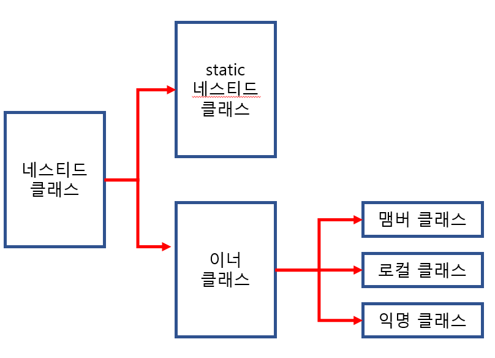

# 네스티드 클래스와 이너 클래스 (람다를 이해하기 위한..)
## 네스티드 클래스란
- 클래스 안에 정의된 클래스를 말한다.
    ```java
    class Outer{ // 외부 클래스
        class Nested{ ... } // 네스티드 클래스
    }
    ```
    ### 네스티드 클래스는 static이 붙은 것과 안 붙은 것으로 나뉜다.
    ```java
    // static이 붙은 네스티드 클래스
    class OuterClass{
        static class StaticNestedClass{ ... }
    }
  
    // static이 붙지 않은 네스티드 클래스 (이너 클래스)
    class OuterClass{
        class InnerNestedClass{ ... }
    }
    ```


## 네스티드 클래스의 종류 4가지
- static 네스티드 클래스
- 맴버 클래스 (이너)
- 로컬 클래스 (이너)
- 익명 클래스 (이너)

<hr>

## static 네스티드 클래스
- static 특성을 반영한 클래스
- 외부 클래스와 별개로 생각할 수 있다.
- 그런데, 외부 클래스의 private 선언을 한 변수에 접근할 수 있다!
```java
class Outer{
    private static int num=0;
    
    static class Nested1{
        // 외부 클래스의 private 변수 num에 직접 접근이 가능하다.
        void add(int n) { num += n; }
    }
    static class Nested2{
        vod get() { return num; }
    }
}
class StaticNested{
    public static void main(String[] args) {
        Outer.Nested1 nst1 = new Outer.Nested1(); // static 네스티드 클래스의 접근
        nst1.add(5);
        
        Outer.Nested2 nst2 = new Outer.Nested2();
        System.out.println(nst2.get());
    }
}
```

## 맴버 클래스
- 인스턴스 변수, 인스턴스 메소드와 동일한 위치에 정의된 클래스
- 외부 클래스의 인스턴스에 종속적이다.
- 외부 클래스를 기반으로 접근이 가능하다.
- [클래스의 정의를 감추어야 할 때 유용하게 사용할 수 있다.]
```java
class Outer{
    class MemberInner{ ... }
}
```
```java
interface Printable{
    void print();
}
class Papers{
    private String con;
    public Papers(String s) { con = s;}
    
    public Printable getPrinter(){
        return new Printer();
    }
    
    private class Printer implements Printable{
        public void print(){
            System.out.println(con);
        }
    }
}

public static void main(String[] args) {
    Papers p = new Papers("서류 내용 : 행복합니다.");
    Printable prn = p.getPrinter();
    prn.print();
    /** main함수에서는 Printer 클래스의 존재를 모르지만, 사용하고 있다. **/
}
```

## 로컬 클래스
- 메소드 내에 정의
- 맴버 클래스보다 클래스의 정의를 더 숨기고자 할 때 사용할 수 있다.
```java
class Outer{
    void method(){
        class LocalInner{ ... }
    }
}
```
```java
interface Printable{
    void print();
}
class Papers{
    private String con;
    public Papers(String s) { con = s;}
    
    public Printable getPrinter(){
        /** 메소드 안으로 감추었다. **/
        class Printer implements Printable{ // 클래스 이름이 불필요하다. -> 익명 클래스 등장
            public void print(){
                System.out.println(con);
            }
        }
        return new Printer();
    }
}

public static void main(String[] args) {
    Papers p = new Papers("서류 내용 : 행복합니다.");
    Printable prn = p.getPrinter();
    prn.print();
    /** main함수에서는 Printer 클래스의 존재를 모르지만, 사용하고 있다. **/
}
```
## 익명 클래스
- 로컬 클래스에서 클래스 이름을 생략하기 위한 방법
- 인터페이스를 반환하는데, 인터페이스의 추상 메소드를 정의한다.
```java
interface Printable{
    void print();
}
class Papers{
    private String con;
    public Papers(String s) { con = s;}
    
    public Printable getPrinter(){
        /** 익명 클래스 **/
        return new Printable(){
            public void print(){
                System.out.println(con);
            }
        };
    }
}

public static void main(String[] args) {
    Papers p = new Papers("서류 내용 : 행복합니다.");
    Printable prn = p.getPrinter();
    prn.print();
}
```

<hr>

# 람다 (Lambda)
- 위의 익명 클래스를 기반으로 코드를 작성하면..
  - 클래스의 정의 과정을 생략할 수 있다.
## 람다를 사용하지 않고, 익명 클래스를 사용한 코드
```java
interface Printable {
    void print(String s);
}

class Lambda2 {
    public static void main(String[] args) {
        Printable prn = new Printable() {
            @Override
            public void print(String s) {
                System.out.println(s);
            }
        }
    }
}
```
## 위의 코드에서 람다를 사용한 코드
```java
interface Printable {
    void print(String s);
}
class Lambda3{
    public static void main(String[] args) {
        Printable prn = (s) -> { System.out.println(s); };
        prn.print("What is Lambda?");
    }
}
```
### ???
- (s)가 어떻게 print(String s) 메소드인지를 알 수 있을까?
    - 단 하나의 추상 메소드만을 가지고 있으니까 -> 가능하다.
###[코드 해석]
- (s) 를 받는 Printable 인터페이스를 생성하는데, 
- 인터페이스를 구현한(1개의 추상메소드를 구현한) 내용은 System.out.println(s)이다.

### 람다의 등장과정
#### 1. 일반 클래스를 사용하자
```java
interface Printable {
    void print(String s);
}

class Printer implements Printable {
    @Override
    public void print(String s) {
        System.out.println(s);
    }
}
class Lambda1{
    public static void main(String[] args) {
        Printable prn = new Printer();
        prn.print("Understand Lambda 1");
    }
}
```
- 일반 클래스가 Printable 인터페이스를 구현하고 있다.
- main함수에서 구현한 Printer 객체를 생성하여 사용한다.
#### 2. 익명 클래스를 사용하자
```java
interface Printable {
    void print(String s);
}

class Lambda2 {
    public static void main(String[] args) { 
        Printable prn = new Printable() {
            @Override
            public void print(String s) {
                System.out.println(s);
            }
        }
    };
    prn.print("Understand Lambda 2");
}
```
#### 3. 익명 클래스에서 필요하지 않은 부분을 생략하자
1. 클래스 이름으로 생성하는 부분 ( public void print(String s) )
2. 추상 메소드가 하나만 존재하는데, 추상 메소드의 이름으로 정의하는 부분 ( public void print(String s) )
```java
interface Printable {
    void print(String s);
}
class Lambda3{
    public static void main(String[] args) {
        Printable prn = (s) -> { System.out.println(s); };
        prn.print("What is Lambda?");
    }
}
```
